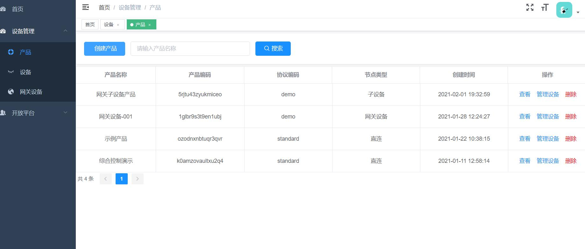

# ByteCub IoT platform

#### 介绍
ByteCub物联网平台PC WEB UI，目前只支持chromium内核浏览器，在IE下部分页面显示会失真

#### 服务端代码
源码地址 [https://gitee.com/byte-cub/bytecub](https://gitee.com/byte-cub/bytecub)

#### 开发环境   
在vue.config.js中修改管理后台请求地址，默认为http://127.0.0.1:8080/
1.  npm install
2.  npm run dev 即可启动开发环境

#### 生产环境  
1.  执行 npm run build:prod
2.  将dist文件上传至服务器
3.  修改nginx配置如下:  
<pre>
    server_name  www.domain.com;
    # gzip config
    gzip on;
    gzip_min_length 1k;
    gzip_comp_level 9;
    gzip_types text/plain text/css text/javascript application/json application/javascript application/x-javascript application/xml;
    gzip_vary on;
    gzip_disable "MSIE [1-6]\.";

    root /home/apps/www/manager-web/dist; #vue dist包存储路径
    include /etc/nginx/mime.types;
    location / {
        index  index.html;
    }

    location /admin/ {
      
        proxy_pass http://127.0.0.1:8080/admin/; #修改此地址为后台服务地址
        proxy_set_header X-Forwarded-Proto $scheme;
        proxy_set_header Host $host:$server_port;
        proxy_set_header X-Real-IP  $remote_addr;
        proxy_set_header X-Forwarded-For $proxy_add_x_forwarded_for;
        proxy_http_version 1.1;
        proxy_set_header Upgrade $http_upgrade;
        proxy_set_header Connection "upgrade";
        proxy_connect_timeout   1;
        proxy_buffering off;
        chunked_transfer_encoding off;
        proxy_cache off;
        proxy_send_timeout      30m;
        proxy_read_timeout      30m;
        client_max_body_size    100m;
    }
}

</pre>
#### 使用说明

(准备中，敬请期待)请移步至 [doc.bytecub.cn](http://doc.bytecub.cn)

#### 部分截图

##### 鸣谢
vue-element-admin

